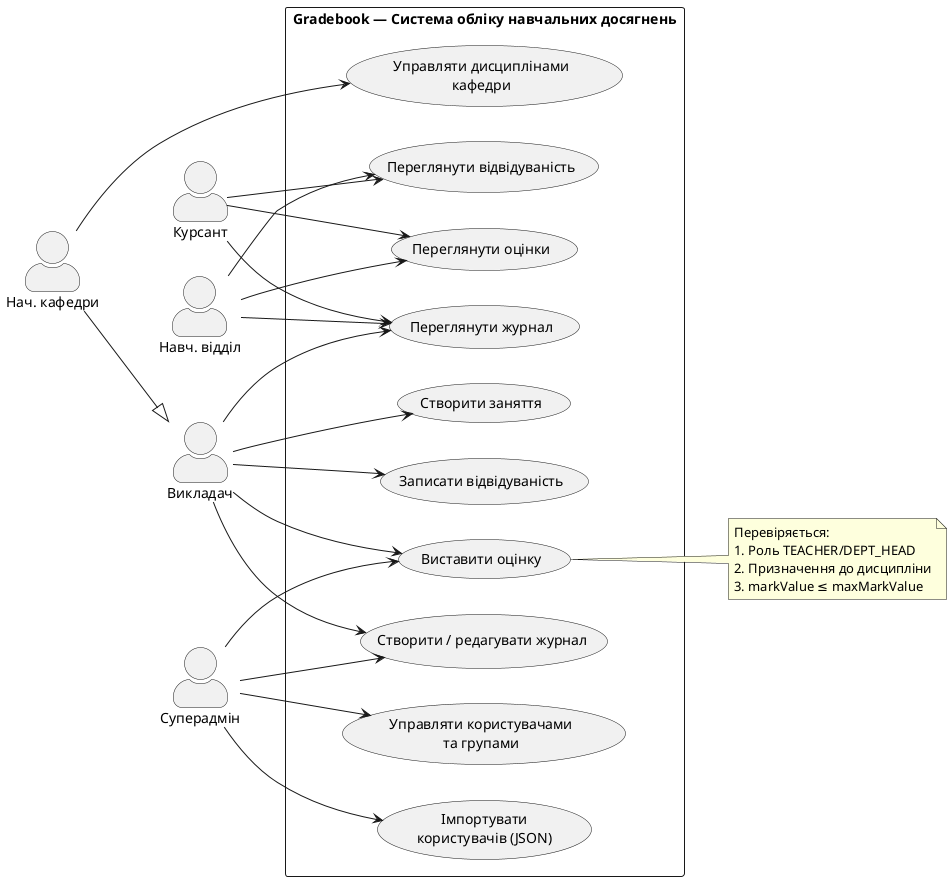
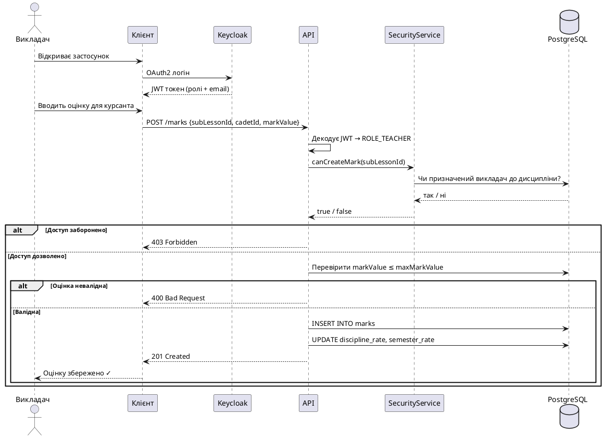
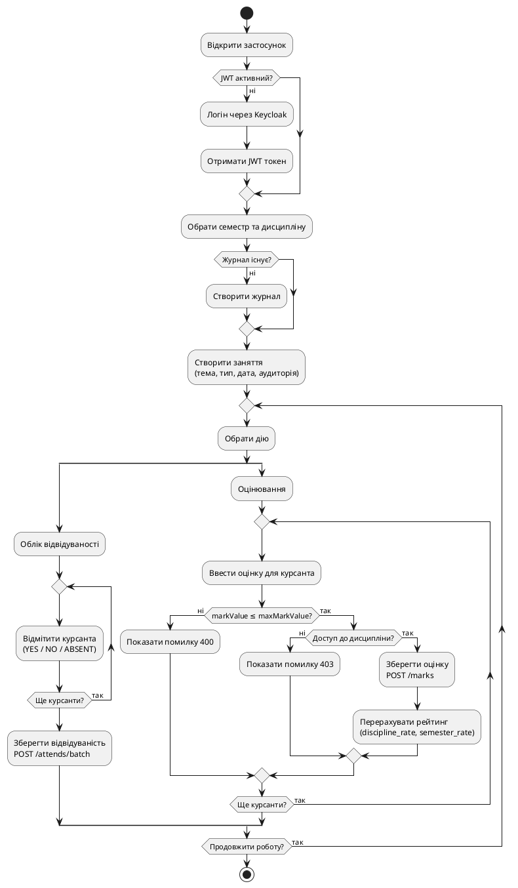

# PZ-UML: Поведінкові UML-діаграми системи «Gradebook»

**Gradebook** — система обліку навчальних досягнень для військового інституту.
Управління журналами, оцінками, відвідуваністю. Автентифікація через Keycloak (JWT/OAuth2).

---

## 1. Use Case Diagram

---

## 2. Sequence Diagram — Виставлення оцінки

---

## 3. Activity Diagram — Проведення заняття

---

## Зв'язок між діаграмами

- **Use Case** — хто і що може робити в системі
- **Sequence** — як виконується сценарій «Виставити оцінку» (деталізує UC5)
- **Activity** — повний workflow заняття від входу до завершення

Інструмент: усі три діаграми — [plantuml.com](https://www.plantuml.com/plantuml/uml/)